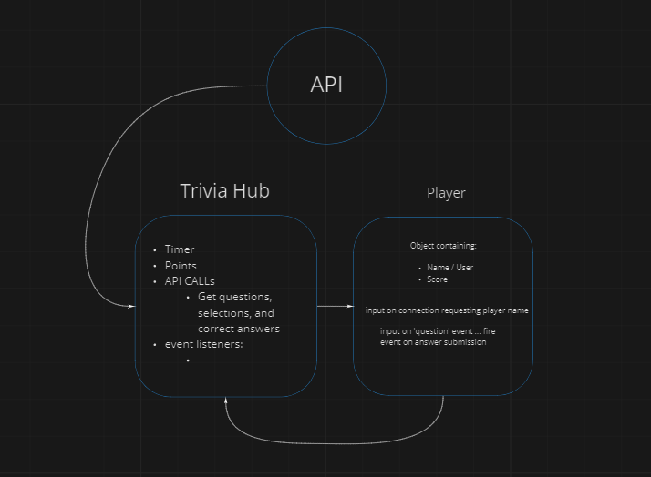

# LAB 14

## App: Trivia-hub

## Authors

- Brandon
- Davion

### Deployment Test

- User terminal

### Setup

- CLI: Readline
- API: Opentdb
- PORT/Socket connection
- .env requirements

### Running the app

- node hub.js
- User: node {user filename}

### Tests

### UML

<!-- (Created with diagrams) -->
